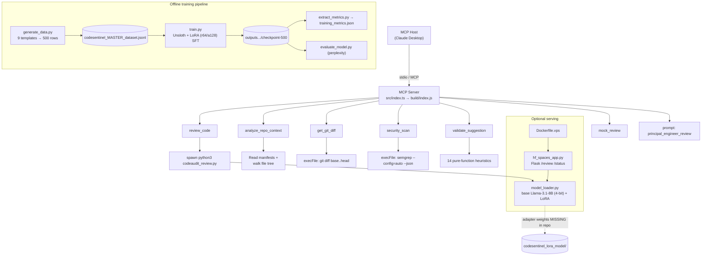

# Design Summary — CodeAudit-MCP

## System Overview
CodeAudit-MCP is a Model Context Protocol server that equips an MCP host (Claude Desktop) with
grounded code-review tools. It exposes typed tools over stdio, orchestrates local binaries
(`git`, `semgrep`, `python3`), infers repository context from manifests, validates AI-proposed
patches with deterministic heuristics, and (when weights are present) generates reviews from a
LoRA-fine-tuned Llama-3.1-8B model. A separate Flask app can serve the same model over HTTP.

## Architecture Diagram

## Component Breakdown

### MCP Server (`src/index.ts`)
- **Purpose:** register MCP prompt + tools; orchestrate subprocesses; format results.
- **Key files:** `src/index.ts`, compiled `build/index.js`; `tsconfig.json`.
- **Inputs:** MCP tool calls (zod-validated), current working directory, git refs, diff strings.
- **Outputs:** text content blocks (JSON or formatted markdown) back to the host.
- **Dependencies:** `@modelcontextprotocol/sdk`, `zod`, Node `child_process`/`fs`; external `git`, `semgrep`, `python3`.

### Repo Context Engine (within `src/index.ts`)
- **Purpose:** infer primary language, framework, deployment model, and project constraints.
- **Inputs:** manifest files + recursive extension counts (ignoring `node_modules`, `.git`, etc.).
- **Outputs:** `RepoContext` JSON (language, framework, deploymentModel, constraints, signals, filesRead).
- **Dependencies:** filesystem only (no network).

### Patch Validator (`validate_suggestion`)
- **Purpose:** flag obviously broken/dangerous diffs before they reach the user.
- **Inputs:** unified diff string, optional language hint.
- **Outputs:** `{ valid, warnings[], inferredLanguage }`.
- **Dependencies:** none (pure functions) — the most cleanly testable component.

### Model Bridge + Loader (`codeaudit_review.py`, `model_loader.py`)
- **Purpose:** load base Llama-3.1-8B (4-bit bnb) + LoRA adapter and generate a review.
- **Inputs:** JSON on stdin (`file`, `language`, `code`, `context`).
- **Outputs:** review JSON (`issues`, `summary`, `suggestions`, `security_concerns`).
- **Dependencies:** transformers, peft, bitsandbytes, torch; **requires adapter weights (absent in repo)**.

### Training Pipeline (`generate_data.py`, `train.py`, `evaluate_model.py`, `extract_metrics.py`)
- **Purpose:** build synthetic SFT data, fine-tune with Unsloth/LoRA, extract metrics.
- **Inputs:** 9 hardcoded templates → `codesentinel_MASTER_dataset.jsonl`.
- **Outputs:** LoRA checkpoint, `training_metrics.json`, `evaluation_results.json`.
- **Dependencies:** unsloth, trl, peft, datasets, transformers, A100-class GPU assumed.

### Serving (`hf_spaces_app.py`, `Dockerfile.vps`)
- **Purpose:** expose the model loader via REST for HF Spaces / a VPS.
- **Inputs:** POST `/review` JSON. **Outputs:** review JSON; `/` and `/status` health checks.
- **Dependencies:** Flask, flask-cors, `model_loader.py`.

### CLI + Setup (`bin/cli.js`, `bin/setup.js`)
- **Purpose:** `start`/`setup`/`help`; auto-write Claude Desktop MCP config cross-platform.
- **Inputs:** argv, OS detection. **Outputs:** spawned server, edited config file.

## Key Design Decisions
- **Tools shell out to trusted local binaries** (`git`, `semgrep`) rather than reimplementing them — grounds review in real tooling. (Evidence: `execFileAsync` calls in `src/index.ts`.)
- **zod schemas per tool** for typed, validated inputs. (Evidence: `inputSchema` blocks.)
- **stdio transport** for direct Claude Desktop embedding. (Evidence: `StdioServerTransport`.)
- **Deterministic validator as pure functions** — keeps patch checks fast and side-effect-free.
- **LoRA + 4-bit quantization** to fit an 8B model on limited VRAM. (Evidence: `train.py`, `model_loader.py`.)
- *(Inference)* Splitting the model into a Python subprocess keeps the Node server light and avoids embedding a Python runtime — reasonable but adds a spawn/IPC boundary. **Marked as inference.**

## Tradeoffs
- **Subprocess coupling:** requires `git`/`semgrep`/`python3` on PATH; failures handled but reduce portability.
- **Heuristic validation vs. real parsing:** regex/bracket-counting heuristics are fast but produce false positives/negatives (no AST).
- **Local model vs. hosted:** local 4-bit inference avoids sending code out, but is slow and heavy; README mentions a hosted fallback that the current code does not implement.
- **Synthetic data:** cheap and controllable, but limited diversity (9 templates) and no real-world signal.

## Reliability / Error Handling
- Semgrep failure path parses partial stdout, else returns a "semgrep unavailable" notice (`handleSemgrepFailure`).
- Git/subprocess errors formatted via `formatCommandError` (message + stderr + stdout).
- `review_code` bridge handles spawn error, non-zero exit, JSON parse failure, and a **3-minute timeout**.
- Startup fatal errors are written to `os.tmpdir()/codeaudit-error.log`.
- **Gaps:** no retries/backoff; no structured logging; smoke tests only; no CI to catch regressions.

## Security / Privacy Considerations
- **Secrets:** `.env` is gitignored; `.env.example` provided (per PROJECT_STATUS/README).
- **Local inference** keeps code on-device (no outbound calls in the local review path).
- **Subprocess safety:** uses `execFile`/`spawn` with argument arrays (not shell string interpolation) — avoids basic shell injection.
- **Flask API:** `hf_spaces_app.py` binds `0.0.0.0` with **no authentication** — anyone with network access can POST code to `/review`. This is a real exposure if deployed as-is; must be flagged before any public deployment.
- **Semgrep `--config=auto`** fetches rulesets and may require network access.

## Testing Strategy
- `test-dependencies.js` — checks required binaries/deps exist.
- `test-tools.js` — smoke-tests context/git/semgrep/validation (re-implements validation logic locally rather than importing the server).
- `test-e2e.js` — builds then runs an end-to-end pass.
- `test-model-integration.js`, `test-together.js`, `diagnose-mcp.js` — model/diagnostic checks.
- **No assertion framework, no coverage, no CI.** README's "10+ tests pass" is unverified here.

## Deployment / Runtime
- **Local (primary):** `npm install` → `npm run build` (`tsc`) → host launches `node build/index.js` over stdio; `bin/setup.js` writes the Claude Desktop config.
- **npm distribution:** `bin: { "codeaudit-mcp": "bin/cli.js" }`, `prepare` runs build. Publishing is described but not verified as published.
- **Model serving:** `hf_spaces_app.py` (port 7860 on HF Spaces / 5000 in Docker) via `Dockerfile.vps` (Ubuntu 24.04, Python 3.12). Requires the missing LoRA weights to function.
